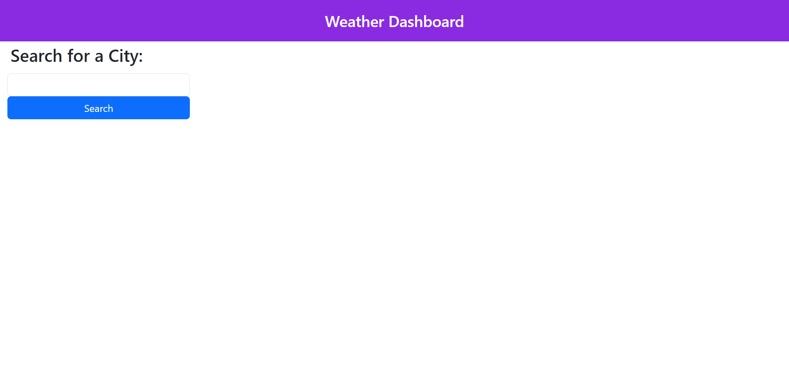
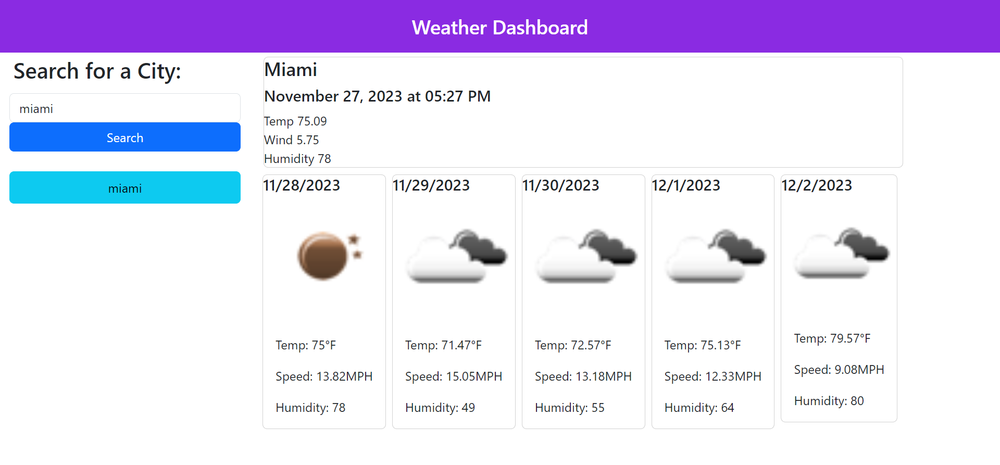
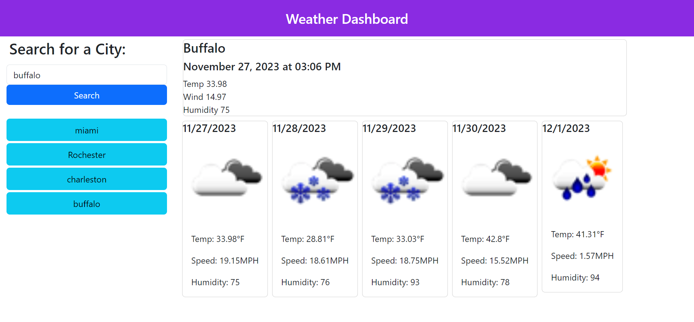

# weather-dashboard-api

## Description

This is a weather dashboard app that uses APIs. It displays the current date, temperature, wind speed, and humidity. It also displays the following five days of the same data. 

## ScreenShot

## Link to deployed application
https://dawnie2021.github.io/weather-dashboard-api/
